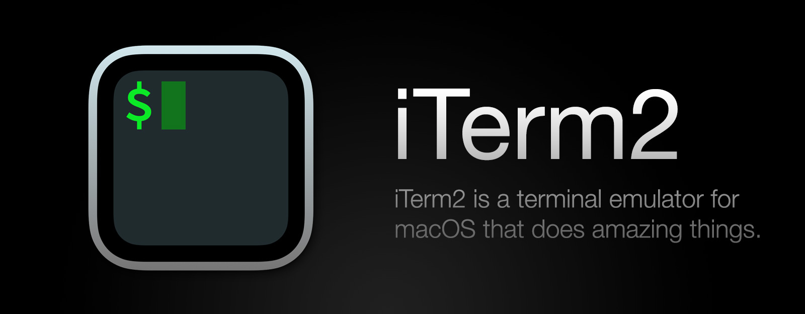

    <picture>
        <source media="(prefers-color-scheme: dark)" srcset="./resources/dark.jpeg">
        <source media="(prefers-color-scheme: light)" srcset="./resources/white.jpeg">
        
    </picture>

## $${\color{#37d99e}\texttt{My Customization Tools}}$$

    <table>
        <tr>
            <th style="color: #37d99e">
                
Tool

            </th>
            <th style="color: #37d99e">
                
Description

            </th>
            <th style="color: #37d99e">
                
Configuration

            </th>
        </tr>
        <tr>
            <td>
                <a href="https://github.com/koekeishiya/yabai">
                    

                        
                    

                </a>
            </td>
            <td style="color: #E5D487">
                
tiling window management

            </td>
            <td>
                <a href="https://github.com/bogdan23a/.config/blob/main/yabai/yabairc">
                    

                        
                    

                </a>
            </td>
        </tr>
        <tr>
            <td>
                <a href="https://github.com/koekeishiya/skhd">
                    
skhd

                </a>
            </td>
            <td style="color: #E5D487">
                
hotkey daemon

            </td>
            <td>
                <a href="https://github.com/bogdan23a/.config/blob/main/skhd/skhdrc">
                    

                        
                    

                </a>
            </td>
        </tr>
        <tr>
            <td style="color: #37d99e">
                <a href="https://github.com/pqrs-org/Karabiner-Elements">
                    

                        
                        
Karabiner Elements

                    

                </a>
            </td>
            <td style="color: #E5D487">
                
utility for keyboard customization

            </td>
            <td>
                <a href="https://github.com/bogdan23a/.config/blob/main/karabiner/karabiner.json">
                    

                        
                    

                </a>
            </td>
        </tr>
        <tr>
            <td>
                <a href="https://github.com/gnachman/iTerm2">
                    

                        
                    

                </a>
            </td>
            <td style="color: #E5D487">
                
terminal emulator

            </td>
            <td>
                <!--  -->
            </td>
        </tr>
        <tr>
            <td>
                <a href="https://github.com/JanDeDobbeleer/oh-my-posh">
                    

                        
                    

                </a>
            </td>
            <td style="color: #E5D487">
                
prompt theme engine

            </td>
            <td>
                <a href="https://github.com/bogdan23a/.config/blob/main/oh-my-posh/bromium.omp.json">
                    

                        
                    

                </a>
            </td>
        </tr>
    </table>

## $${\color{#37d99e}\texttt{IDEs}}$$

    <table>
        <tr>
            <th style="color: #37d99e">
                
Tool

            </th>
            <th style="color: #37d99e">
                
Description

            </th>
            <th style="color: #37d99e">
                
Configuration

            </th>
        </tr>
        <tr>
            <td>
                <a href="">
                    

                        
                    

                </a>
            </td>
            <td style="color: #E5D487">
                
Java IDE

            </td>
            <td>
                <a href="https://plugins.jetbrains.com/plugin/23426-matrix">
                    

                        
                    

                </a>
            </td>
        </tr>
        <tr>
            <td>
                <a href="">
                    

                        
                    

                </a>
            </td>
            <td style="color: #E5D487">
                
code editor

            </td>
            <td>
                <a href="https://marketplace.visualstudio.com/items?itemName=TheBromo.bromium">
                    

                        
                    

                </a>
            </td>
        </tr>
    </table>

